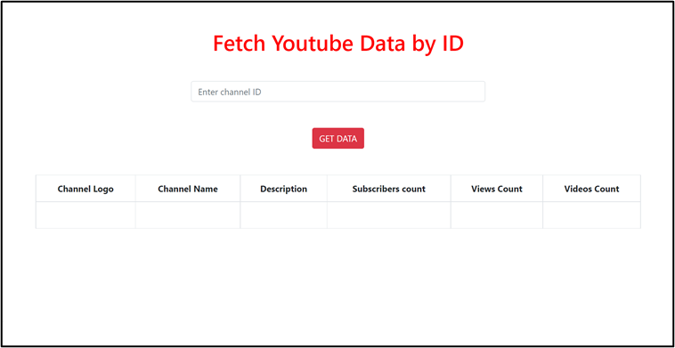

# Youtube Data API v3

### Youtube Data API is used to fetch youtube data like channel name, description, viewers count, subscribers count, videos count etc.

# ❓ About 
- This project fetches youtube data 
- Here, PHP is used to fetch data

# Appearance 

#  🧐 For more information
- Click the link given below 
    - https://developers.google.com/youtube/v3/docs
    - https://console.cloud.google.com/apis/library/youtube.googleapis.com?project=my-api-keys-368706

# 📝 Licensed by 

# 👸🏻 Created by 
Created with 🤍 by <a href="https://github.com/CODING-Enthusiast9857" target="_blank">Madhavi Sonawane.</a>